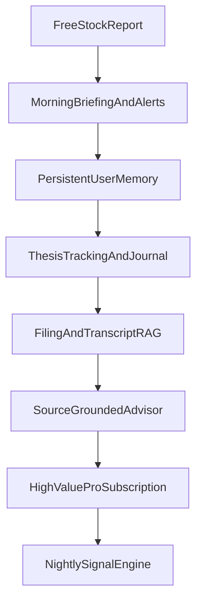

# MarketFlux Product And Architecture Plan

## Positioning

MarketFlux should launch as the AI research brain for concentrated long-term retail investors, not as a generic stock chatbot or robo-advisor.

Best initial wedge:

- Investors with roughly 5-20 positions who want institutional-style diligence without Bloomberg pricing.
- Core promise: remember my thesis, track what matters, and tell me when my thesis is getting stronger or weaker.

Why this wedge wins:

- It is less crowded than generic AI stock chat, portfolio tracking, or AI stock-picking.
- It matches your current stack: live market data, news, insider activity, screeners, and AI chat already exist.
- It creates repeat usage through monitoring, alerts, and memory instead of one-off research.

## Current State

What exists today:

- Active AI chat and tool-routing in [MarketFlux/backend/agent_router.py](../../MarketFlux/backend/agent_router.py), [MarketFlux/backend/react_agent.py](../../MarketFlux/backend/react_agent.py), and [MarketFlux/backend/agent_tools.py](../../MarketFlux/backend/agent_tools.py).
- News-only semantic retrieval via `embed_and_store_news()`, `_semantic_search_news()`, and `get_news()` in [MarketFlux/backend/agent_tools.py](../../MarketFlux/backend/agent_tools.py).
- User/session chat history but not durable user memory in [MarketFlux/backend/server.py](../../MarketFlux/backend/server.py), [MarketFlux/backend/ai_service.py](../../MarketFlux/backend/ai_service.py), and [MarketFlux/frontend/src/components/AIChatbot.js](../../MarketFlux/frontend/src/components/AIChatbot.js).
- Watchlist, portfolio, and streams primitives already present in [MarketFlux/backend/server.py](../../MarketFlux/backend/server.py).

What is missing:

- No filing or transcript content ingestion.
- No document chunking for long-form sources.
- No durable vector store or reranking.
- No persistent user profile/thesis memory.
- No real alert engine or nightly signal pipeline.

## Product Roadmap

### Phase 1: Acquisition And Retention Engine

Ship the smallest loop that gets users in, brings them back daily, and creates switching costs.

Launch first:

- Free instant stock report.
- Morning briefing tied to watchlist and portfolio.
- AI memory that recalls prior questions, held stocks, risk style, and thesis context.
- Watchlist alerts for target price, insider selling, sentiment shifts, and earnings events.

Defer for later:

- One-click trade execution.
- Public performance tracking.
- Full autonomous signals as the main value prop.

Reason:

- Free reports drive acquisition.
- Briefings and alerts create daily retention.
- Memory and thesis tracking create moat.

## Research Moat

Build a product moat around workflow, trust, and personalization rather than raw data access.

Primary moat features:

- Persistent research memory: thesis, assumptions, KPI watchlist, red flags, and decision journal per user.
- Thesis-diff engine: compare what changed across earnings, filings, news, and management tone.
- Source-grounded trust layer: every AI claim should cite the exact filing/transcript/news passage.
- Sector playbooks: semis, SaaS, banks, REITs, biotech each need different KPI templates and risk checklists.
- Portfolio-specific research: connect what a user owns to proactive analysis and alerts.

Best premium feature to justify a higher tier:

- Personal AI investment advisor mode backed by user memory plus thesis tracking, not generic chat.
- Example premium outputs: “Based on your style, your current portfolio, and your past research on NVDA/AMD, here is what changed this week and what deserves attention now.”

## Technical Roadmap

### 1. Upgrade RAG From News-Only To Source-Grounded Research

Extend the existing retrieval layer in [MarketFlux/backend/agent_tools.py](../../MarketFlux/backend/agent_tools.py).

Add new ingestion pipelines for:

- SEC filing text.
- Earnings call transcripts.
- Investor presentations or shareholder letters later.

Add chunking for long documents:

- Start with 512-token chunks and 50-token overlap.
- Store metadata per chunk: ticker, doc_type, filing_date, section_name, source_url, chunk_id.

Add new retrieval tools:

- `get_filing_chunks(symbol, query)`
- `get_transcript_chunks(symbol, query)`
- `get_research_context(symbol, query)` that merges news + filings + transcripts.

Integrate into live agent path:

- Register tools in `TOOL_REGISTRY` and `QUERY_TYPE_TOOLS` in [MarketFlux/backend/agent_tools.py](../../MarketFlux/backend/agent_tools.py).
- Update tool execution and formatting in [MarketFlux/backend/agent_router.py](../../MarketFlux/backend/agent_router.py).
- Make the same retrieval available to the ReAct tool-calling path in [MarketFlux/backend/react_agent.py](../../MarketFlux/backend/react_agent.py).

### 2. Add Durable Retrieval Infrastructure

Replace the current process-memory-only store.

Current limitation:

- `_news_store` in [MarketFlux/backend/agent_tools.py](../../MarketFlux/backend/agent_tools.py) is capped, ephemeral, and not citation-grade.

Upgrade path:

- Move embeddings and chunk metadata into a durable store.
- Near-term pragmatic option: MongoDB collection with vectors plus metadata if scale is modest.
- Better medium-term option: dedicated vector DB or pgvector.
- Add reranking after retrieval for final top-k passages.

NVIDIA fit:

- Use NVIDIA NeMo Retriever embeddings as a drop-in replacement for local `SentenceTransformer` embeddings.
- Add NVIDIA reranking NIM between retrieval and answer generation.
- Keep generation on Gemini initially unless NVIDIA LLM cost/quality clearly wins in testing.

### 3. Add User Memory As The Core Premium Layer

Build memory around user identity and research behavior.

Memory objects to store:

- Portfolio summary.
- Risk tolerance and time horizon.
- Investment style: value, quality, growth, momentum, income.
- Stocks researched, thesis notes, watch KPIs, risk triggers.
- Conversation-derived preferences and recurring sectors.

Primary integration points:

- [MarketFlux/backend/server.py](../../MarketFlux/backend/server.py) for authenticated entrypoints.
- [MarketFlux/backend/ai_service.py](../../MarketFlux/backend/ai_service.py) for short-term chat/context assembly.
- [MarketFlux/frontend/src/components/AIChatbot.js](../../MarketFlux/frontend/src/components/AIChatbot.js) for session/UI hooks.
- [MarketFlux/frontend/src/contexts/AuthContext.js](../../MarketFlux/frontend/src/contexts/AuthContext.js) for tying memory to user identity.

Memory design:

- Use structured memory, not raw transcript stuffing.
- Persist summaries like `user_style`, `owned_tickers`, `thesis_map`, `risk_rules`, and `recent_focus`.
- Periodically compress long history into structured user facts.

### 4. Turn Existing Watchlist And Streams Into An Alert System

Use what already exists instead of building from scratch.

Leverage existing surfaces:

- Watchlist endpoints in [MarketFlux/backend/server.py](../../MarketFlux/backend/server.py).
- Streams endpoints in the same file as saved filter definitions.
- Watchlist UI in [MarketFlux/frontend/src/pages/StockDetail.js](../../MarketFlux/frontend/src/pages/StockDetail.js).
- News feed personalization in [MarketFlux/frontend/src/pages/NewsFeed.js](../../MarketFlux/frontend/src/pages/NewsFeed.js).

First alert types:

- Price target hit.
- Insider buy/sell in watchlist.
- Earnings in 24 hours.
- Material sentiment shift.
- Thesis-break alert from filing/transcript/news evidence.

### 5. Build The Daily Retention Loop Before Full Autonomy

Implement a “what changed for me” product layer before nightly alpha claims.

First recurring jobs:

- Morning personalized briefing.
- Earnings radar pre-brief and post-earnings reaction.
- Watchlist pulse for alerts.

Later recurring jobs:

- Nightly signal generation across the tracked universe.
- Portfolio stress scenarios.
- Verified research performance attribution.

Likely insertion point today:

- Extend the scheduler pattern near `periodic_news_fetch()` in [MarketFlux/backend/server.py](../../MarketFlux/backend/server.py), then graduate to a real worker/job queue once product-market fit is proven.

## Best Revenue Niche

Best first-paying audience:

- Serious self-directed retail investors with concentrated portfolios and a desire to act like fundamental analysts.

Why this audience:

- They feel the pain of information overload.
- They already pay for research tools or expensive newsletters.
- They care more about trust, memory, and monitoring than casual investors do.
- They are more likely to convert on “portfolio-specific thesis monitoring” than on generic market chat.

Good secondary audience later:

- Small RIAs and small funds via API/licensing after the consumer workflow is proven.

## Dexter Parity & HeyAstral-for-Investors

### Dexter Gaps to Close (if matching)

| Dexter Capability         | MarketFlux Status          | Action                                                 |
| ------------------------- | -------------------------- | ------------------------------------------------------ |
| Task decomposition        | Intent classification only | Add query → sub-tasks for complex questions            |
| Scratchpad / step logging | Thinking events in SSE     | Persist `.dexter/scratchpad`-style JSONL for debugging |
| Filing reader tool        | None                       | Add `get_filing_chunks` (RAG roadmap)                  |
| Browser scraping          | None                       | Defer — focus on structured data first                 |
| SKILL.md workflows        | None                       | Add extensible SKILL-based workflows (e.g. DCF)        |
| LangSmith evals           | None                       | Add LangSmith tracing + evals for agent quality        |

### HeyAstral-for-Investors (Investor-First, Not Trader-First)

HeyAstral targets **active traders** (backtesting, live execution, strategy building). MarketFlux should be **HeyAstral for investors**:

- **No execution** — research and monitoring only (compliance-friendly)
- **Thesis-first** — remember positions, thesis, KPIs; notify on changes
- **Source-grounded** — filings, transcripts, news with citations
- **Portfolio-aware** — “what changed for my holdings?” not “run this strategy”
- **Long-horizon** — quarterly earnings, filing updates, macro context, not intraday signals

Product pillars for “HeyAstral for investors”:

1. **Instant research** — current AI chat + comparison charts (already shipping)
2. **Thesis memory** — persistent notes, KPIs, red flags per position
3. **Proactive briefings** — morning briefing, earnings radar, thesis-break alerts
4. **Source citations** — every claim links to filing/transcript/news
5. **Portfolio lens** — macro, sector, and stock analysis filtered by holdings

## What To Avoid

Do not anchor the launch around:

- “AI stock picker” messaging.
- Generic chatbot positioning.
- Broker-first workflows.
- Fully autonomous trading before trust and compliance posture exist.

## Execution Sequence

## Success Criteria

Phase 1 success:

- Users generate free reports and return for briefings/alerts.
- Users save watchlists and ask repeated follow-up questions.
- Memory makes answers visibly more personalized week over week.

Phase 2 success:

- AI answers cite filing/transcript/news passages.
- Alerts become useful enough to drive daily/weekly active use.
- Thesis tracking creates switching costs and better retention.

Phase 3 success:

- Premium tier is justified by personalized research memory and advisor workflow, not just more chats.
- API/licensing becomes credible once the core research engine is reliable and source-grounded.

