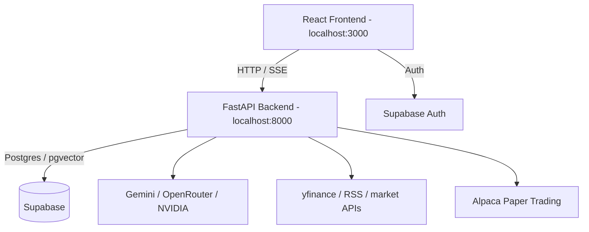

# MarketFlux

AI-powered investment research, market intelligence, conversational paper-trading copilot, and Supabase-backed quant research workspace.

## Current Stack

| Tier | Technologies |
| :--- | :--- |
| Frontend | React CRA + CRACO, Tailwind CSS, Radix/shadcn-style UI, Recharts |
| Backend | FastAPI, Python, async services, Server-Sent Events |
| Primary data/auth | Supabase Auth, Supabase Postgres, pgvector |
| Compatibility | Legacy Mongo mirrors/fallbacks remain in parts of the backend |
| AI/data | Gemini, OpenRouter/NVIDIA optional, yfinance, RSS feeds, Alpaca paper trading |

## Local Development

Backend runs on `8000`; frontend runs on `3000`.

```bash
cd MarketFlux/backend
./venv/bin/python -m uvicorn server:app --reload --host 127.0.0.1 --port 8000
```

```bash
cd MarketFlux/frontend
BROWSER=none HOST=127.0.0.1 PORT=3000 REACT_APP_BACKEND_URL=http://localhost:8000 npx craco start --config craco.config.dev.js
```

Open `http://localhost:3000`.

## Environment

Frontend:

```env
REACT_APP_BACKEND_URL=http://localhost:8000
REACT_APP_SUPABASE_URL=https://your-project.supabase.co
REACT_APP_SUPABASE_ANON_KEY=your-anon-key
```

Backend:

```env
ALLOWED_ORIGINS=http://localhost:3000
SUPABASE_URL=https://your-project.supabase.co
SUPABASE_ANON_KEY=your-anon-key
SUPABASE_SERVICE_KEY=your-service-role-key
SUPABASE_DB_URL=postgresql://...
GEMINI_API_KEY=your-gemini-key
APCA_API_KEY_ID=your-paper-api-key-id
APCA_API_SECRET_KEY=your-paper-api-secret-key
```

`MONGO_URL` may still appear for legacy fallback paths, but new local setup should be Supabase-first.

## Architecture



## Useful Checks

```bash
cd MarketFlux/frontend
CI=true npx craco test --watchAll=false --passWithNoTests
CI=true npx craco build --config craco.config.dev.js
```

```bash
cd MarketFlux/backend
./venv/bin/python -m pytest tests/test_pilot_smoke.py tests/test_thesis_router_unittest.py tests/test_thesis_backfill_unittest.py tests/test_policy_engine_unittest.py -v
```
