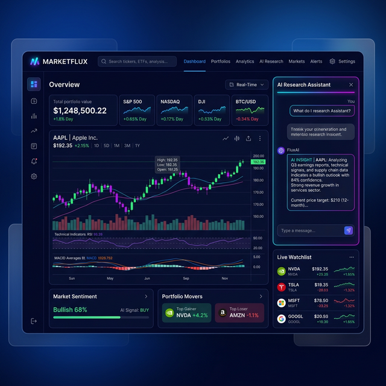
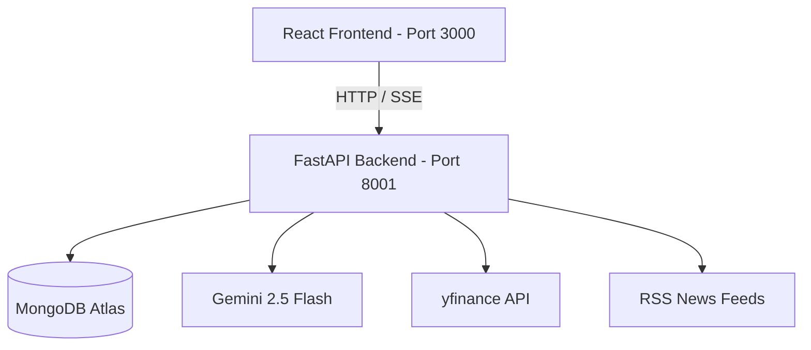

# MarketFlux 📈
AI-Powered Investment Research & Real-Time Market Intelligence



## Overview
**MarketFlux** is a state-of-the-art investment research platform that leverages AI to provide real-time stock data, intelligent screeners, and sentiment-driven news aggregation. Designed for both professional analysts and retail investors, MarketFlux transforms complex financial data into actionable insights through a seamless, premium interface.

---

## 🌟 Key Features
- **AI Research Assistant**: A powerful LLM-driven chat experience for deep-diving into stock fundamentals, technicals, and market trends.
- **Natural Language Stock Screener**: Filter through thousands of equities using conversational queries.
- **Sentiment-Driven News Feed**: Real-time aggregation from 7+ major financial RSS feeds with AI-powered sentiment analysis.
- **Real-Time Market Dashboard**: Interactive dark-mode visualizations using Recharts and Shadcn/UI.
- **Portfolio Management**: Holistic view of your investments with performance tracking and watchlists.

## 🛠️ Tech Stack
| Tier | Technologies |
| :--- | :--- |
| **Frontend** | React, Tailwind CSS, Shadcn/UI, Recharts |
| **Backend** | FastAPI (Python 3.10+), AsyncIO |
| **Database** | MongoDB Atlas (via Motor driver) |
| **AI/ML** | Google Gemini 2.5 Flash |
| **Data Sources** | yfinance, Multiple Financial RSS Feeds |

---

## 🚀 Getting Started

### Prerequisites
- Python 3.10+
- Node.js & Yarn/npm
- MongoDB Atlas Account
- Google Gemini API Key

### Installation

1. **Clone the Repo**
   ```bash
   git clone https://github.com/Jashwanth2343/Marketflux.git
   cd Marketflux
   ```

2. **Backend Setup**
   ```bash
   cd MarketFlux/backend
   pip install -r requirements.txt
   # Create a .env file based on the environment variables section below
   uvicorn server:app --reload --port 8001
   ```

3. **Frontend Setup**
   ```bash
   cd ../frontend
   yarn install
   # Create a .env file for frontend if needed
   yarn start
   ```

## ⚙️ Environment Variables
Create a `.env` file in the `MarketFlux/backend/` directory:
```env
MONGO_URL=your_mongodb_connection_string
DB_NAME=MarketFlux
EMERGENT_LLM_KEY=your_gemini_api_key
JWT_SECRET_KEY=your_random_32_hex_string
ALLOWED_ORIGINS=http://localhost:3000
```

---

## 🏗️ Architecture


## 🛤️ Roadmap & Future Improvements
- [ ] **Data Source Upgrade**: Replace `yfinance` with professional-grade APIs (Polygon.io/Finnhub).
- [ ] **Advanced RAG**: Implement vector search (ChromaDB) for more accurate LLM context.
- [ ] **Infrastructure**: Containerize with Docker for AWS/GCP orchestration.
- [ ] **Testing**: Achieve 80%+ coverage with Pytest and RTL.

---

## 🤖 Autoresearch Mode
Inspired by [Andrej Karpathy's autoresearch](https://github.com/karpathy/autoresearch), MarketFlux
can improve its own AI agent overnight — completely autonomously.

### How it works
| Karpathy's autoresearch | MarketFlux equivalent |
|---|---|
| `train.py` — LLM training code | `react_agent.py` — AI agent system prompt |
| `val_bpb` metric (lower is better) | Composite eval score (higher is better, max 5.0) |
| `program.md` — research instructions | `program.md` — what to optimise |
| 5-minute training budget | Fixed eval test-suite (~6 financial queries) |

Each iteration the agent:
1. Reads `program.md` for guidance on what to optimise.
2. Proposes one targeted improvement to `REACT_SYSTEM_PROMPT` in `react_agent.py`.
3. Runs `eval_pipeline.py` (LLM-as-a-judge on 6 representative queries).
4. **Keeps the change** if the composite score improves; **reverts** otherwise.
5. Logs everything to `autoresearch_log.json`.

### Running autoresearch
```bash
cd MarketFlux/backend
# Run 10 iterations (approx. overnight default)
python autoresearch.py --iterations 10

# Run a quick 3-iteration test
python autoresearch.py --iterations 3

# Custom log path
python autoresearch.py --iterations 20 --log my_experiments.json
```

In the morning, inspect `autoresearch_log.json` to see which changes were accepted.
Edit `program.md` to steer the agent toward different optimisation goals.

---

Created by [Jashwanth2343](https://github.com/Jashwanth2343)
